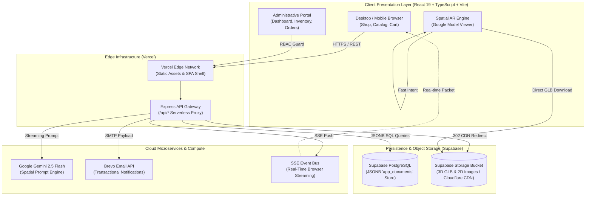

<div align="center">

# 🪑 AR-Fit (ARFurniture)

### **Next-Gen WebXR Augmented Reality Furniture Commerce Platform**
*Millimeter-Accurate Spatial Sizing · Real-Time Photorealistic Variant Customization · Edge-Driven Cloud Fulfillment*

[](https://arfurniture-final.vercel.app/)
[](https://react.dev/)
[](https://www.typescriptlang.org/)
[](https://modelviewer.dev/)
[](https://supabase.com/)
[](https://ai.google.dev/)
[](https://vercel.com/)
[](LICENSE)

[🌐 Live Production](https://arfurniture-final.vercel.app/) • [📱 Mobile AR Guide](#-spatial-augmented-reality-engine) • [⚙️ Architecture](#-system-architecture) • [🚀 Quick Start](#-quick-start) • [🛡️ Security & RBAC](#-role-based-access-control-rbac)

---

</div>

## 📖 Executive Summary

**AR-Fit** is a high-performance, full-stack spatial e-commerce progressive web application engineered to eliminate the **"sizing uncertainty gap"** in online furniture retail. By uniting **WebXR hardware plane tracking**, **Google ARCore Scene Viewer**, **Apple ARKit QuickLook**, and **Google Gemini 2.5 Flash Generative AI**, AR-Fit allows customers to inspect furniture at **1:1 millimeter physical scale** in their physical living spaces before placing an order.

Architected on a hybrid **React 19 + Vite** frontend, a **Vercel Serverless Edge API**, and a **Supabase PostgreSQL JSONB Document Store**, the platform delivers instant edge response times, frictionless checkout following **Jakob's Law**, and comprehensive multi-tier administrative fulfillment.

---

## ⚡ Key Highlights & Core Capabilities

```
┌────────────────────────────────────────────────────────────────────────────────────────┐
│                                 CORE FEATURE ECOSYSTEM                                 │
└────────────────────────────────────────────────────────────────────────────────────────┘
       │                                   │                                  │
       ▼                                   ▼                                  ▼
[ 📐 Spatial WebXR Engine ]      [ 🛒 Frictionless E-Commerce ]     [ 🤖 Google Gemini AI ]
• 1:1 True-to-scale anchoring    • Jakob's Law zero-login cart     • Context-aware room stylist
• ARCore & ARKit Dual Pipeline   • LocalStorage guest sync         • Spatial dimension validator
• Ground contact shadow physics  • 2-Step Philippine checkout      • Material & care assistant
• Dual-pulse haptic feedback     • Dynamic PH Province/City data   • Real-time prompt streaming
```

### 📐 Spatial Augmented Reality Engine
* **Universal Cross-Platform AR Pipeline:** Automatically detects client hardware capabilities:
  * **Android (`ARCore`):** Prioritizes native Google Scene Viewer (`mode=ar_only`) for instant plane detection and zero-latency hardware tracking, with an optional toggle to in-browser WebXR.
  * **iOS (`ARKit`):** Native QuickLook USDZ integration across Safari and Chrome.
  * **Desktop Handoff:** Instant, 1-click dynamic QR code modal bridging desktop shoppers directly to mobile camera AR.
* **Millimeter-Accurate Physical Calibration:** Enforces `ar-scale="fixed"` and `resizable=false` to prevent accidental sizing distortion during room inspection.
* **Optical Grounding Physics:** Uses 1.8-intensity contact ambient shadows with 0.75 softness and 200ms interpolation smoothing to eliminate the "floating furniture" optical illusion.
* **Tactile Haptic Feedback:** Triggers dual-pulse haptic vibration (`[40ms, 50ms, 40ms]`) the instant the model locks onto horizontal physical flooring.
* **3D Binary Pre-caching:** Background `<link rel="prefetch">` loads 25MB+ `.glb` assets during spec inspection, reducing AR launch latency to under 500ms.

### 🎨 Real-Time Material & Wood Swapping
* Interactive 3D variant switcher supporting traditional Philippine indigenous hardwoods:
  * **Original Finish**
  * **Narra** *(Reddish Brown)*
  * **Kamagong** *(Ironwood)*
  * **Acacia** *(Golden Brown)*
  * **Molave** *(Light Straw)*
* Dynamically updates 3D WebGL material shaders and generates real-time color-tinted 2D thumbnail previews.

### 🛒 Jakob's Law Frictionless Checkout
* **Zero Cart Roadblocks:** Guests can configure variants, add to cart, and modify quantities without forced login prompts. Cart state persists in `localStorage` (`arfurniture_guest_cart`).
* **Automated Guest-to-Member Cart Merge:** Signing in or creating an account during checkout automatically synchronizes guest selections into the PostgreSQL user cart.
* **2-Step Modern Checkout Experience:**
  * **Step 1 (Contact & Philippine Address):** Recipient name, Philippine mobile number regex validation (`/^09\d{9}$/`), Province and City selector presets (`PH_PROVINCES` / `PH_CITIES`), landmarks, and optional profile address saving.
  * **Step 2 (Payment Method & Review):** Selection between Cash on Delivery (COD), GCash / Maya E-Wallet, or Credit / Debit Card, with an active delivery preview card and 12% Philippine VAT breakdown.
* **Permanent Order Receipt:** Comprehensive confirmation screen displaying Order Reference `#XXXXXX`, email invoice notice, delivery details, itemized line items, and 1-click tracking.

### 🤖 Generative AI Design Assistant
* Powered by the **Google Gemini 2.5 Flash API**.
* Context-aware interior stylist embedded inside `ProductDetail.tsx`:
  * Answers spatial fit inquiries (`"Will this 180cm sideboard fit in a 3-meter studio wall?"`).
  * Advises on wood pairing, maintenance, and seasonal decor aesthetics.
  * Evaluates clearance allowances and room traffic pathways.

### 📡 Multi-Channel Communications & Real-Time Sync
* **Server-Sent Events (SSE):** Real-time push notifications streamed to connected customer and admin browsers for instant status updates.
* **Transactional Email (Brevo / Sendinblue):** Automated HTML email dispatch for order confirmations, fulfillment milestones, and 6-digit secure password resets.

---

## 🏛️ System Architecture



---

## 💻 Tech Stack Specification

| Domain | Technology | Version | Purpose / Rationale |
| :--- | :--- | :---: | :--- |
| **Frontend Framework** | [React](https://react.dev/) | `^19.0.0` | Next-generation declarative UI with concurrent rendering and hooks. |
| **Language** | [TypeScript](https://www.typescriptlang.org/) | `^5.8.2` | End-to-end type safety, strict interface contracts, and autocompletion. |
| **Build Tooling** | [Vite](https://vite.dev/) | `^6.2.0` | Sub-second HMR and optimized Rollup production asset chunking. |
| **Styling & Design** | [Tailwind CSS](https://tailwindcss.com/) | `^3.4.1` | Utility-first responsive design, backdrop blur filters, and micro-animations. |
| **3D & Augmented Reality**| [@google/model-viewer](https://modelviewer.dev/) | `^4.0.0` | Standardized WebXR plane tracking, Scene Viewer, and QuickLook engine. |
| **Server & Edge API** | [Express](https://expressjs.com/) on [Vercel](https://vercel.com/) | `^4.21.2` | Lightweight serverless micro-router handling REST endpoints and auth. |
| **Database** | [Supabase PostgreSQL](https://supabase.com/) | PostgreSQL 15 | High-reliability relational engine using enterprise JSONB document architecture. |
| **Object Cloud Storage** | [Supabase Storage](https://supabase.com/storage) | S3 API | Cloudflare-backed asset CDN delivering 3D models and high-res imagery. |
| **Artificial Intelligence** | [Google Gemini 2.5 Flash](https://ai.google.dev/) | `^0.24.1` | Ultra-low latency spatial and interior design generative intelligence. |
| **Transactional Email** | [Brevo (Sendinblue)](https://www.brevo.com/) | REST API | Automated transactional email notifications and 6-digit password verification. |
| **Iconography** | [Lucide React](https://lucide.dev/) | `^1.16.0` | Lightweight, pixel-perfect modern iconography. |

---

## 🗄️ Database Architecture (`app_documents`)

AR-Fit utilizes a high-throughput **JSONB Document Store** hosted on PostgreSQL. This combines the schema-less agility of document databases (MongoDB-style) with PostgreSQL's ACID transaction guarantees, relational foreign constraints, and indexing power.

```sql
CREATE TABLE IF NOT EXISTS app_documents (
  collection TEXT NOT NULL,
  id TEXT NOT NULL,
  document JSONB NOT NULL DEFAULT '{}'::jsonb,
  created_at TIMESTAMPTZ NOT NULL DEFAULT timezone('utc', now()),
  updated_at TIMESTAMPTZ NOT NULL DEFAULT timezone('utc', now()),
  PRIMARY KEY (collection, id)
);

-- B-Tree partition index for lightning-fast collection queries
CREATE INDEX IF NOT EXISTS app_documents_collection_idx ON app_documents (collection);

-- GIN index for high-speed deep JSONB path filters ($gte, $or, $contains)
CREATE INDEX IF NOT EXISTS app_documents_document_gin_idx ON app_documents USING gin (document);
```

### Partitioned Logical Collections
* `users` — Customer identity profiles, passwords (bcrypt-hashed), and Philippine address arrays.
* `admins` — Privileged staff credentials (`username`, `password`, `role`: `'admin' | 'superadmin'`).
* `products` — Furniture specifications, millimeter dimensions, stock counters, wood finish arrays, and CDN URLs.
* `orders` — Customer purchase manifests, line items, recipient data, contact phone, payment method, and status.
* `carts` — Persistent server-side user shopping bags synchronized across devices.
* `marketing_banners` — Promotional homepage billboard campaigns and sale event links.
* `notifications` — Real-time customer activity feed with read/unread flags.
* `password_resets` — 6-digit verification tokens, attempt throttles, and expiry deadlines.

---

## 🛡️ Role-Based Access Control (RBAC)

AR-Fit implements a strict three-tier authorization model guarding customer and administrative boundaries:

```
┌────────────────────────────────────────────────────────────────────────┐
│                      ROLE-BASED PERMISSION MATRIX                      │
└────────────────────────────────────────────────────────────────────────┘
```

| Permission / Surface | Guest | Customer (`user`) | Staff (`admin`) | Executive (`superadmin`) |
| :--- | :---: | :---: | :---: | :---: |
| **Browse Catalog & Real-Time Search** | ✅ | ✅ | ✅ | ✅ |
| **WebXR 3D Model Room Placement** | ✅ | ✅ | ✅ | ✅ |
| **Frictionless Add-to-Cart** | ✅ | ✅ | ✅ | ✅ |
| **Gemini AI Design Consultation** | ✅ | ✅ | ✅ | ✅ |
| **Order Placement & Address Book** | ❌ *(Requires Sign-in)* | ✅ | ✅ | ✅ |
| **Personal Order History (`/orders`)** | ❌ | ✅ | ❌ *(Admin View)* | ❌ *(Admin View)* |
| **Executive Analytics Dashboard (`/admin`)** | ❌ | ❌ | ✅ | ✅ |
| **Product & Inventory Management** | ❌ | ❌ | ✅ | ✅ |
| **Order Status Workflow & Fulfillment** | ❌ | ❌ | ✅ | ✅ |
| **Marketing Banner Campaigns** | ❌ | ❌ | ✅ | ✅ |
| **Store Branding Settings** | ❌ | ❌ | ✅ | ✅ |
| **Staff & Admin Management (CRUD)** | ❌ | ❌ | ❌ | ✅ |

### Default Development Credentials
> [!NOTE]
> Used for verification and staging audits:
* **Super Administrator:** `superadmin` / `SuperAdmin123!`
* **Store Administrator:** `admin` / `Admin123!`
* **Test Customer:** `customer_test@example.com` / `Password123!`

---

## 🚀 Quick Start

### Prerequisites
* **Node.js:** `v18.0.0` or higher
* **npm:** `v9.0.0` or higher
* A free [Supabase](https://supabase.com/) project (PostgreSQL + Storage)

### 1. Clone & Install Dependencies
```bash
git clone https://github.com/jevvii/arfurniture-final.git
cd arfurniture-final

# Install dependencies
npm install
```

### 2. Environment Configuration
Create a `.env` file in the project root:
```env
# Application Port
PORT=4000

# Client API Base (Leave empty in production for relative proxying)
VITE_AUTH_API_BASE=

# Supabase Credentials (DB & Object Storage)
SUPABASE_URL=https://<your-project-id>.supabase.co
SUPABASE_SERVICE_ROLE_KEY=<your-service-role-key>
SUPABASE_DB_URL=postgresql://postgres:<password>@db.<your-project-id>.supabase.co:5432/postgres
SUPABASE_DB_TABLE=app_documents
SUPABASE_STORAGE_BUCKET=arfurniture
STORAGE_PROVIDER=supabase
STORAGE_BUCKET=arfurniture

# Generative AI Intelligence
GEMINI_API_KEY=<your-google-gemini-api-key>

# Transactional Email (Optional)
BREVO_API_KEY=<your-brevo-api-key>
```

### 3. Bootstrap Database & Seed Data
Initialize the PostgreSQL table schema, provision the initial superadmin, and populate catalog inventory:
```bash
# Initialize PostgreSQL schema, indexes, and triggers
node scripts/bootstrap-supabase.mjs

# Provision default superadmin account
node scripts/seed-superadmin.mjs

# Seed initial furniture catalog and marketing banners
node scripts/seed-products.mjs
node scripts/seed-banners.mjs
```

### 4. Run Development Servers
```bash
# Terminal 1: Launch Backend API Server (Port 4000)
npm run server:dev

# Terminal 2: Launch Frontend Vite HMR (Port 5173)
npm run dev
```
Open [http://localhost:5173](http://localhost:5173) in your browser.

---

## 📦 Production Build & Deployment

### Build Verification
```bash
npm run build
```
Generates a minified production bundle inside `dist/`.

### Deploying to Vercel
1. Push your repository to GitHub.
2. Import the project into [Vercel](https://vercel.com/).
3. Add the environment variables from your `.env` into Vercel's **Project Settings ➔ Environment Variables**.
4. Deploy! Vercel automatically honors `vercel.json` routes:
   - `/api/(.*)` ➔ `api/index.js` (Express Serverless Function)
   - `/(.*)` ➔ `dist/index.html` (Single Page Application Fallback)

---

## 📁 Repository Directory Structure

```text
ARfurniture-main/
├── api/                      # Vercel Serverless Edge entrypoints
│   └── index.js              # Serverless Express wrapper
├── components/               # Reusable presentation components
│   ├── AuthModal.tsx         # Modern tabbed authentication dialog
│   ├── ColorTintedImage.tsx  # Dynamic color-tinted 2D preview generator
│   ├── Layout.tsx            # Global sticky navbar, drawer & footer
│   ├── ModelViewerWrapper.tsx# WebXR 3D canvas with shadow physics
│   ├── NotificationBell.tsx  # Real-time SSE notification listener
│   └── QRCodeModal.tsx       # Desktop-to-mobile AR handoff modal
├── contexts/                 # Global React State Contexts
│   ├── AuthContext.tsx       # Multi-role authentication & session state
│   └── CartContext.tsx       # Unified guest & member cart controller
├── docs/                     # Academic documentation, diagrams & schemas
│   ├── PROJECT_STRUCTURE.png # System component architecture visual
│   ├── cart_schema.md        # Cart JSON specification
│   └── order_system.md       # Order lifecycle documentation
├── pages/                    # Application Views & Pages
│   ├── Admin/                # Administrative & Executive Protected Views
│   │   ├── AdminDashboard.tsx# Real-time analytics, revenue & charts
│   │   ├── AdminLogin.tsx    # Administrative authentication portal
│   │   ├── MarketingManager.tsx # Carousel banner campaign manager
│   │   ├── OrderManagement.tsx  # Order fulfillment, search & status updates
│   │   ├── ProductManager.tsx   # 3D Catalog CRUD & variant editor
│   │   └── Settings.tsx      # Staff RBAC manager & branding controls
│   └── Customer/             # Customer-Facing Surfaces
│       ├── ARView.tsx        # Ergonomic mobile AR placement studio
│       ├── Cart.tsx          # Jakob's Law 2-step checkout & receipt
│       ├── Orders.tsx        # Personal order tracking with real-time badges
│       ├── ProductDetail.tsx # 3D viewer, finish swatches & Gemini AI
│       ├── Profile.tsx       # Customer address book & profile settings
│       └── Shop.tsx          # Main storefront, search & category filters
├── scripts/                  # Cloud migration, seeding & bootstrap utilities
│   ├── bootstrap-supabase.mjs# Creates PostgreSQL table, indexes & triggers
│   ├── migrate-assets-to-supabase.mjs # Migrates 3D models to Supabase Bucket
│   ├── seed-products.mjs     # Seeds initial product inventory
│   └── seed-superadmin.mjs   # Seeds initial superadministrator
├── server/                   # Backend Express microservices
│   ├── config/               # Database, storage & environment setup
│   ├── middleware/           # RBAC guards & rate limiters
│   ├── routes/               # API endpoints (auth, products, orders, assets)
│   └── services/             # Email, SSE & database client drivers
├── constants.ts              # Global app constants & CDN URL resolver
├── ph-address-data.ts        # Philippine standard Province/City dataset
├── types.ts                  # Comprehensive TypeScript type definitions
└── vercel.json               # Edge deployment routing & header configuration
```

---

## 🤝 Research Citation & Acknowledgements

Developed as part of the academic and engineering research initiative:  
**"An Augmented Reality System for Accurate Furniture Sizing and Order Precision"**  
*Valenzuela City Information Technology Initiative.*

Special thanks to:
* The **Google WebXR & Model-Viewer Team** for open spatial standards.
* The **Supabase Community** for resilient edge persistence and storage APIs.

---

<div align="center">
  <sub>Built with ❤️ for spatial retail precision. Distributed under the MIT License.</sub>
</div>
